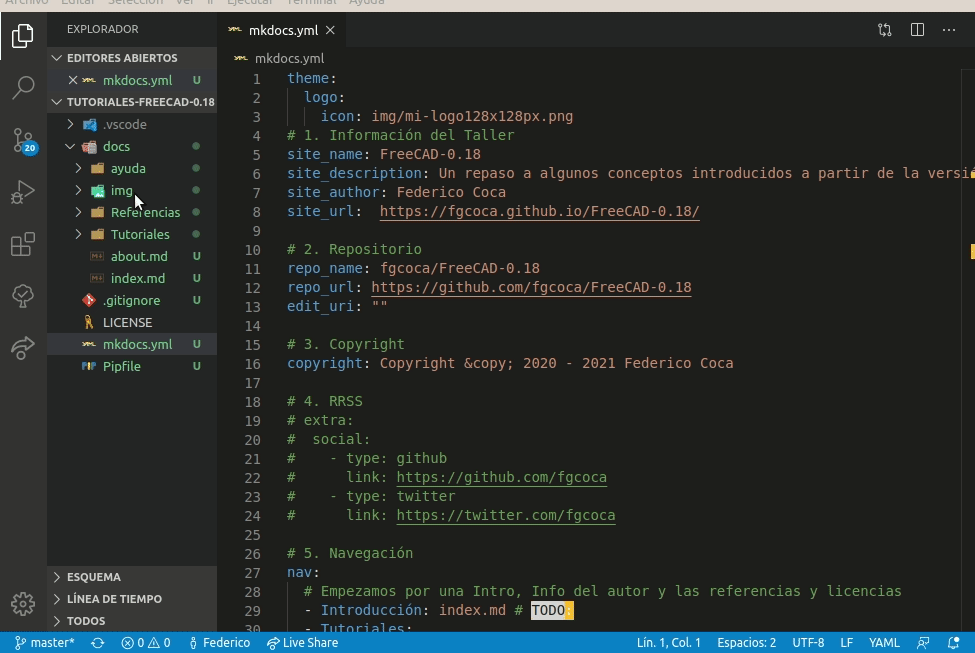

# Editor VSCode

## Introducción y configuración inicial

Según la Wikipedia, Visual Studio Code es un editor de código fuente desarrollado por Microsoft para Windows, Linux y macOS. Incluye soporte para la depuración, control integrado de Git, resaltado de sintaxis, finalización inteligente de código, fragmentos y refactorización de código. Es un proyecto de software libre que se distribuye bajo la licencia MIT, aunque los ejecutables se distribuyen bajo una licencia gratuita no libre.

Para [descargar VSCode visitamos](https://code.visualstudio.com/) y escogemos según nuestro sistema, en mi caso los paquetes Debian válidos para Ubuntu.

| _Imagen 1_ |  
| :-: |  
|| 
|_Descarga de VSCode_|

Cuando iniciamos VSCode el aspecto que nos presenta es el que vemos en la imagen 2.

| _Imagen 2_ |  
| :-: |  
||
|_Pantalla inicial de VSCode_|

Lo primero que vamos a hacer en configurar el idioma y para ellos hacemos clic en el icono de _Extensiones_ de la barra lateral izquierda y procedemos según lo indicado en la imagen 3.

| _Imagen 3_ |  
| :-: |  
||
|_Configurar idioma en VSCode_|

Una vez reiniciado VSCode ya tenemos el editor en español, como vemos en la imagen 4.

| _Imagen 1_ |  
| :-: |  
||
|_Entorno de VSCode configurado en idioma español_|

## Instalación de extensiones en VSCode

Vamos a instalar el paquete Python en VSCode, para ello abrimos el programa y hacemos clic en el icono de extensiones y en el buscador tecleamos python y hacemos clic en el botón Install señalado en la imagen 5.

| _Imagen 5_ |  
| :-: |  
||
|_Instalación paquete Python_|

Se inicia el proceso de instalación que se verá de la forma que muestra la imagen 6.

| _Imagen 6_ |  
| :-: |  
||
|_Instalación paquete Python en proceso_|

Una vez finalizada la instalación nos indicará que se requiere una recarga de Python, lo que hacemos clicando el botón señalado en la imagen 7.

| _Imagen 7_ |  
| :-: |  
||
|_Recarga de Python_|

Si necesitamos otras extensiones las podemos instalar de forma similar a las anteriores.

Si ahora cerramos la pestaña de bienvenida tendremos la expresión mínima se VSCode (imagen 8) y veremos de fondo los comando de inicio mas habituales.

| _Imagen 8_ |  
| :-: |  
||
|_Expresión mínima de VSCode_|

## El Explorador de VSCode

VSCode incorpora la utilidad de _Abrir carpeta_ que resulta especialmente útil cuando tenemos que trabajar con un conjunto de archivos que se encuentran en una carpeta o directorio. Esta opción nos va a mostrar la lista de archivos contenidos en ese directorio para no tener que abrir de forma individualizada cada archivo.

En la bienvenida ya está disponible la opción y siempre lo vamos a poder hacer o bien desde la barra de actividades o bien desde el menú Archivo. En la imagen 9 se muestra el proceso para abrir una carpeta desde el Explorador.

| _Imagen 9_ |  
| :-: |  
||
|_Abrir carpeta desde el Explorador_|

Vemos que también se incorpora la opción de Clonar un repositorio directamente desde VSCode si conocemos la URL del mismo.

Una vez localizada y abierta la carpeta con la que vamos a trabajar el Explorador se presenta como vemos en la imagen 10.

| _Imagen 10_ |  
| :-: |  
||
|_Carpeta de trabajo abierta_|

En la imagen 10 observamos en modo árbol los archivos y subdirectorios que contiene la carpeta abierta y que podemos abrir para su edición. También se pueden ver una serie de cambios que iremos analizando poco a poco.

Si necesitamos cerrar la carpeta tenemos la opción disponible en el menú Archivo, tal y como se muestra en la imagen 11.

| _Imagen 11_ |  
| :-: |  
||
|_Cerrar carpeta_|

## Configuración de VSCode

Podemos acceder a las opciones de configuración haciendo clic en el icono rueda dentada de la barra de actividades o bien desde el menú Archivo, como se observa en la imagen 12.

| _Imagen 12_ |  
| :-: |  
||
|_Opciones de configuración de VSCode_|

La configuración por defecto del editor está suficientemente estudiada como para no necesitar ajustes aunque siempre es posible modificar cualquiera de las opciones disponibles a nuestro gusto. No nos vamos a detener en este tema pero si vamos a ver un poco más de la opción Configuración propiamente dicha, que es la primera que aparece y que también es accesible con la combinación de teclas [Ctrl+,]. Si accedemos a ella se nos abrirán en la zona de trabajo las opciones de configuración como vemos en la imagen 13.

| _Imagen 13_ |  
| :-: |  
||
|_Opciones de configuración de VSCode_|

Aquí tenemos disponibles infinidad de opciones tanto de Usuario como del Área de trabajo que podemos configurar según nuestras propias necesidades. A titulo de ejemplo vamos a ver como cambiar el tema color y también opciones referente a los iconos que aparecen asociados al explorador.

Al tema de configuración de color podemos acceder de cualquiera de las formas que se observan en la imagen 14.

| _Imagen 14_ |  
| :-: |  
||
|_Configuración del tema color_|

Observamos que el tema por defecto es el _Dark+_en el que vamos a permanecer. En la imagen 15 vemos el aspecto en dos configuraciones diferentes de color.

| _Imagen 15_ |  |
| :-: | :-: | 
|  |  |
|_Tema color light+_ | _Tema color alto contraste_ |

También podemos modificar el tema iconos asociado a los archivos que se muestran en el explorador al que accedemos por cualquiera de los medios mostrados en la imagen 16.

| _Imagen 16_ |  
| :-: |  
||
|_Configuración del tema iconos_|

VSCode por defecto tan solo dispone de tres posibilidades que son las mostradas en la imagen 17.

| _Imagen 17_ |  
| :-: |  
||
|_Opciones por defecto de tema iconos_|

Si accedemos según la imagen 18 podemos directamente entrar en la opción de instalar nuevos iconos.

| _Imagen 18_ |  
| :-: |  
||
|_Acceso rápido a la opción de instalar iconos_|

Una vez seleccionada la opción se nos mostrará algo similar a la imagen 19. En esta imagen observamos como hay disponibles iconos tanto para VSCode como para Material, que es la librería que estamos utilizando.  Vamos a instalar uno de cada para poder analizarlos.

| _Imagen 19_ |  
| :-: |  
||
|_Opciones para instalar temas de iconos_|

## Explorador de VSCode

Ya hemos visto anteriormente como abrir una carpeta desde el explorador y ahora vamos a ver algunas opciones de las que disponemos en el mismo. Para abrir un archivo lo seleccionamos con un clic en el explorador y a continuación hacemos doble clic sobre el mismo.

Cuando tenemos abierta una carpeta tenemos la posibilidad desde el mismo explorador de crear archivos, carpetas, actualizar y contraer carpetas, como se muestra en la imagen 20. Los iconos de estas tareas solamente son visibles cuando situamos el cursor del ratón en la ventana del Explorador.

| _Imagen 20_ |  
| :-: |  
||
|_Opciones relativas al explorador_|

En la parte superior del explorador tenemos la lista de archivos abiertos para edición así como los iconos de las tareas posibles a realizar, tal y como se observa en la imagen 21.

| _Imagen 21_ |  
| :-: |  
||
|_Editores abiertos_|

A veces resulta interesante tener abierto dos veces el mismo archivo para poder comparar dos partes del mismo que no podemos ver en una sola ventana. En la parte superior derecha tenemos el icono que lo hace posible tal y como observamos en la imagen 22, donde observamos que tenemos abierto el mismo archivo dos veces.

| _Imagen 22_ |  
| :-: |  
||
|_Opción de dividir editor_|

Hay otra forma especialmente útil de añadir archivos a la ventana de  edición y establecer su disposición si existe ya algún archivo abierto. Esto es haciendo clic sobre el mismo y arrastrándolo hasta dicha ventana. Existen tres formas de hacerlo y la explicación la vamos a ver en la animación correspondiente a cada una de ellas que sigue a continuación.

**1.- Abrir a pantalla completa**

**2.- Abrir en división o disposición vertical**

**3.- Abrir en división o disposición horizontal**

## Buscar en VSCode

El icono de la lupa es la forma más rápida de acceder a las tareas de búsqueda. Un vez activado desde la barra de actividades tiene el aspecto de la imagen 23.

| _Imagen 23_ |  
| :-: |  
||
|_Buscar_|

Asociados a la búsqueda hay tres iconos que de izquierda a derecha sirve para hacer coincidir mayúsculas y minúsculas, solo palabras completas, usar expresiones regulares.

Si necesitamos reemplazar las búsquedas por algo concreto basta con teclearlo en la ventana correspondiente que tiene como iconos asociados el de conservar mayúsculas y minúsculas y el de reemplazar todo.

El icono diéresis justo debajo de la ventana reemplazar nos permite filtrar en que archivos y carpetas buscar o excluirlos esos archivos para la búsqueda. En la imagen 24 vemos las opciones activadas.

| _Imagen 24_ |  
| :-: |  
||
|_Incluir / Excluir en la búsqueda_|

Debemos tener presente que VSCode ya tiene en su configuración la exclusión de algunas carpetas para la búsqueda. De cuales se trata lo podemos ver accediendo a la configuración, tal y como observamos en la imagen 25.

| _Imagen 25_ |  
| :-: |  
||
|_Archivos desactivados para la búsqueda_|

## IntelliSense

Es la función de autocompletado usada en el entorno de desarrollo integrado Microsoft Visual Studio y también en el editor de código Visual Studio Code.

Visual Studio Code trae esta funcionalidad por defecto para JavaScript, TypeScript, CSS, HTML JSON, Less y Sass. También existen extensiones para otros muchos lenguajes y vamos a ver como instalar alguna de ellas. En la imagen 26 vemos ls búsqueda y selección de la que vamos a instalar en nuestro caso.

| _Imagen 26_ |  
| :-: |  
||
|_Instalación de autocompletado para C++_|

Una vez instalada la extensión basta con crear un archivo nuevo y salvarlo como cpp y se mostrará algo similar a la imagen 27.

| _Imagen 27_ |  
| :-: |  
||
|_Habilitación de la extensión autocompletar c++_|

Al pulsar en Mostrar recomendaciones se nos muestra la sugerencia de instalar la que vemos en la imagen 28.

| _Imagen 28_ |  
| :-: |  
||
|_Instalación extension recomendada_|

Una vez instalada la recomendación nos situamos en el archivo creado al efecto y nada más comenzar a teclear sucederá algo similar a lo que vemos en la imagen 29. El editor ya reconoce el lenguaje y nos muestra las sugerencias adecuadas.

| _Imagen 29_ |  
| :-: |  
||
|_Autocompletado en funcionamiento_|

Pues bien, si escogemos la primera opción se nos crea la estructura básica de la función principal de un programa C++ tal y como vemos en la imagen 30.

| _Imagen 30_ |  
| :-: |  
||
|_Resultado del autocompletado_|

En la imagen 29 observamos que a la izquierda de cada sugerencia hay un icono y este tiene un determinado significado con el cual nos iremos familiarizando poco a poco con el uso. A titulo de ejemplo a continuación vemos algunos de estos iconos y su significado.

| Iconos | Significado |
| :-: | --- |
| | Code snippet  o fragmento de código |
| | Palabras clave del lenguaje |
| | Valores, referencias y enumeraciones |
| | Atributos |

## Terminal de comandos integrado en VSCode

VSCode incorpora la posibilidad de mostrar una o varias terminales de comandos del sistema operativo donde se ejecuta en la ventana de trabajo y hay dos formas básicas de hacerlo, bien desde el menú _Ver/Terminal_ o bien desde el menú _Terminal/Nueva terminal_. En cualquier caso el resultado lo vemos en la imagen 31.

| _Imagen 31_ |  
| :-: |  
||
|_Terminal de comandos_|

El funcionamiento de este bash, terminal o consola es idéntico al del sistema pero además lleva asociada una barra con distintas tareas e iconos algunos de los cuales vamos a describir a continuación.

En la imagen 32 tenemos una captura de la tarea PROBLEMAS. Aquí se nos muestran tanto el número como una descripción de los problemas encontrados en los archivos que actualmente tengamos abiertos. Lo ideal es que ningún archivo tenga ningún tipo de advertencia. Pero no siempre será posible, como nos va a ocurrir con las etiquetas HTML `
 
` que serán marcadas como advertencia pero que al no pertenecer a MarkDown no se puede resolver.

| _Imagen 32_ |  
| :-: |  
||
|_Indicación de los problemas encontrados en el código_|

En este caso nos indica dos problemas  que vamos a analizar y resolver. En concreto las dos advertencias se refieren al fichero about.md como se observa en la imagen 33, donde además se observa cómo ambos problemas están señalados. Cuando hacemos un clic sobre el problema este quedará señalado en el archivo y aparecerá una bombillita azul que nos dará opciones relativas al mismo.

| _Imagen 33_ |  
| :-: |  
||
|_Fichero en el que están los problemas_|

El primer problema se refiere a que tras una linea de título o cabecera debe ir una línea en blanco y tenemos básicamente tres formas de solucionarlo:

1. Insertar las línea a mano.
2. Hacer clic en la advertencia (la bombillita azul) para que se muestren las opciones disponibles y escoger una de ellas. En la imagen 34 vemos las opciones.
3. También podemos acceder a estas opciones si hacemos clic derecho en la consola sobre el problema en cuyo caso veremos algo como la imagen 35 con un par de opciones más disponibles.

| _Imagen 34_ |  
| :-: |  
||
|_Opciones disponibles en la corrección del problema_|

| _Imagen 35_ |  
| :-: |  
||
|_Otra opción de mostrar las opciones disponibles de corrección_|

Ahora señalamos el segundo problema tal y como se muestra en la imagen 36. En este caso se refiere a un espacio que no debería existir.

| _Imagen 36_ |  
| :-: |  
||
|_Problema de espacio indebido destacado_|

Una vez solucionados los problemas la consola muestra el aspecto que vemos en la imagen 37.

| _Imagen 37_ |  
| :-: |  
||
|_Sin problemas en los archivos abiertos_|

Veamos ahora la propia terminal y sus iconos asociados. En la imagen 38 tenemos la información necesaria referente a esto.

| _Imagen 38_ |  
| :-: |  
||
|_Iconos de TERMINAL_|

## Barra de estado de VSCode

Cuando no tenemos abierta ninguna carpeta ni área de trabajo la barra de estado se muestra en color morado, tal y como se observa en la imagen 39.

| _Imagen 39_ |  
| :-: |  
||
|_Barra de estado sin carpeta abierta_|

Cuando tenemos abierta una carpeta esta barra se muestra en azul y en distintas partes de las misma se muestra información muy importante relativa al estado del editor y del documento en uso en ese momento. Si dejamos el cursor del ratón situado sobre cualquiera de los elementos nos aparece un mensaje explicando ese apartado. Veamos alguno de ellos.

En la imagen 40 vemos la información de la rama actual (el asterisco indica que hay tareas pendientes) y en la parte superior se muestran las ramas que tiene el proyecto y nos da la posibilidad de crear nuevas ramas. El icono de la derecha permite sincronizar los cambios que hacemos.

| _Imagen 40_ |  
| :-: |  
||
|_Ramas e información de su estado_|

Lo siguiente que vemos en la barra de estado son los problemas del fichero actual, que vamos a analizar a continuación. En la imagen 41 vemos un problema recurrente (flechas rojas) que se refiere a unas etiquetas de centrado que no pertenecen al lenguaje que estamos usando y que por tanto no podemos evitar como error. Por otro lado el problema destacado en amarillo se refiere al texto alternativo de la imagen que podemos omitir, pero que no es conveniente, especialmente si pensamos en una posible carga lenta en el navegador o más aún si pensamos en personas con visibilidad disminuida que no sabrán que ocurre durante esa carga lenta si no hay texto alternativo. Es por tanto buena práctica poner siempre ese texto.

| _Imagen 41_ |  
| :-: |  
||
|_Análisis de problemas en archivo_|

## Atajos de teclado

Hasta ahora hemos ido citando la forma de acceder a las distintas opciones de una o dos formas y hemos omitido siempre la de atajos de teclado que usualmente aparece asociada a la opción y es porque le vamos a dedicar este apartado en el que pondré simplemente los que yo mismo suelo utilizar mas a menudo. El lector adaptará a sus propias necesidades los que mas le interesen.

Como cualquier editor, y yo diría casi que cualquier programa, VSCode incluye los característicos copia (Ctrl+C), corta (Ctrl+X) y pega (Ctrl+V) como atajos de teclado para edición. En la imagen 61 los vemos destacados.

Otros atajos de edición que se suelen utilizar con asiduidad son los que vemos en la imagen 42.

| _Imagen 42_ |  
| :-: |  
||
|_Atajos deshacer, rehacer, buscar y reemplazar_|

Las opciones de desplazamiento del cursor más usuales son las siguientes:

| Combinación de teclas | Acción que realiza |
|:-:|---|
| Inicio | Ir al principio de la línea en la que se encuentra |
| Fin | Ir al final de la línea en la que se encuentra |
| Ctrl + Inicio | Ir al principio del archivo actual |
| Ctrl + Fin | Ir al final del archivo actual |

Otro grupo interesante de atajos de teclado son las diferentes opciones de visualización o apariencia que tenemos disponibles en el menú Ver. En la imagen 43 vemos las disponibles junto a sus atajos.

| _Imagen 43_ |  
| :-: |  
||
|_Opciones de visualización_|

El _modo zen_ muestra el contenido de la pestaña seleccionada ocupando toda la pantalla como vemos en la imagen 44. Observamos que tan solo se muestra el contenido del fichero sin barra de estado ni de menús y demás complementos evitando así distracciones.

| _Imagen 44_ |  
| :-: |  
||
|_Vista en modo zen_|

Para salir podemos pulsar la combinación de teclas o dos veces la tecla ESC.
