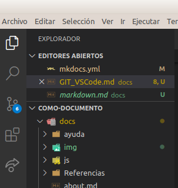

# Git en VSCode

## Cosas básicas de Git

Git es un **software libre** de gestión de versiones, lo que viene a significar que es un sistema que nos ayuda a controlar y gestionar los cambios generados en nuestro trabajo, ya sea software, documentación o cualquier otro uso.

Fue creado por [Linus Torvalds](https://es.wikipedia.org/wiki/Linus_Torvalds) para la comunidad Linux hacia el año 2005.

La relación de tareas fundamentales en git y que vamos a describir en este tutorial son las siguientes:

* Configurar e inicializar un repositorio
* Iniciar y detener el seguimiento de archivos
* Preparar cambios con `stage`
* Confirmar cambios con `commit`
* Configurar git para que ignore ciertos archivos
* Corregir errores
* Recorrer la historia de nuestro proyecto y ver cambios entre confirmaciones
* Enviar con `push` y recibir con `pull` de repositorios remotos

Es necesario conocer, aunque sea brevemente, en que consisten estos pasos para poder efectuarlos con garantias desde VSCode. Se remite al lector a la webgrafía para consultar estos aspectos, y mas concretamente al libro de git.

Desde la paleta de comandos, disponible como se observa en la imagen 1, podemos hacer uso de comandos git.

| _Imagen 1_ |
| :-:|
|  |
| _Acceso a la paleta de comandos_ |

En la imagen 2 vemos la paleta de comandos con el comando clone de git y como una vez ejecutado nos pide la dirección URL a clonar.

| _Imagen 2_ | |
| :-:| :-:|
|  |  |
| _Comando git clone_ | _Solicitud URL para clonar_ |

## Git en la barra de estado de VSCode

En la barra de estado que se muestra en la parte inferior de la ventana de VSCode se muestran funciones e información de Git muy útiles.

* A la izquierda se muestra el nombre de la rama de trabajo actual. Si modificamos los archivos con seguimiento en la rama de trabajo, la barra de estado agrega un símbolo de asterisco (*) junto al nombre de la rama, tal y como se observa en la imagen 3.

| _Imagen 3_ |
| :-:|
|  |
| _Barra de estado: Rama de trabajo actual mostrando cambios_ |

Cuando agreguemos los cambios al `stage`, el asterisco se va a convertir en un signo más (+) para indicar que se han agregado. Cuando confirmemos los cambios `staged`, ese signo más desaparece y solamente se mostrará el nombre de la rama.

* A la derecha del nombre de la rama aparece un icono en forma de un círculo con flechas que indica que el sistema debe sincronizar cambios. En la imagen 4 vemos este icono.

| _Imagen 4_ |
| :-:|
|  |
| _Barra de estado: icono sincronizar cambios_ |

Ese icono con forma de circulo se convierte en una nube con una flecha hacia arriba cuando el sistema está listo para publicar cambios.

## Cambios en archivos

El editor VSCode dispone en su barra de actividades de un acceso a las herramientas git disponibles por defecto y, como veremos mas adelante, también se le pueden instalar complementos para este tema. En la imagen 5 observamos es icono de acceso y vemos un número en un circulo azul que nos indica que hay un número determinado de cambios pendientes de sincronizar con la nube. El número indica cuantos cambios hay pendientes, tanto staged como unstaged (con seguimiento y sin seguimiento)) y listos para confirmarse. El número se incrementa a medida que realicemos cambios en los archivos.

| _Imagen 5_ |
| :-:|
|  |
| _Herramientas GIT en VSCode_ |

Este número se corresponde con la aparición de un asterisco (*) en la barra de estado junto al nombre de la rama en la que estamos trabajando.

Una vez confirmemos, este icono  con número desaparece asi como el asterisco de la barra de estado.

También podemos consultar esto desde una terminal ejecutando un `git status` que nos devolverá información como la que vemos en la imagen 6. Lo habitual será usar una combinación de operaciones de Git desde la línea de comandos y funciones de Visual Studio Code integradas con Git.

| _Imagen 6_ |
| :-:|
|  |
| _Consulta del estado de git desde una terminal_ |

##  Ver cambios en Control de código fuente

Si pulsamos el icono de `Control de código fuente` de la barra de actividades (como vemos en la imagen 7) podremos ver los cambios `staged` y `unstaged`.

| _Imagen 7_ |
| :-:|
|  |
| _Acceso a Control de cambios_ |

Si hacemos clic, por ejemplo, en el archivo que vemos en la imagen 8 observamos una serie de iconos e información asociada al mismo que vamos a describir seguidamente.

| _Imagen 8_ |
| :-:|
|  |
| _Información de control de seguimiento_ |

Lo primero que observamos es que el archivo aparece en **cambios**. Los iconos de izquierda a derecha son:

* **Archivo**: permite abrir el archivo en el editor .
* **Signo más (+)**: Al pulsar este icono se agregan los cambios al "stage" y se confirman.
* **Flecha sentido antihorario**: para descartar los cambios y revertir el archivo a su estado en la confirmación anterior.
* **Número**: indica los problemas que el editor encuentra en el archivo, tal y como se describió para la terminal. En este caso concreto 9+ nos está indicando que hay más de 9 problemas.
* **Letra**: Si es una _M_ nos indica que el archivo existía anteriormente y ha sido modificado y si es una _U_ nos está indicando que el archivo es nuevo y no tiene seguimiento.

Moviendo el cursor por los distintos archivos que se muestran en cambios podemos ir viendo toda la información descrita y realizando las acciones asociadas a los iconos.

Si presionamos el signo más por ejemplo en el archivo i1.png este archivo se traslada a la sección `cambios almacenados provisionalmente` o `stage`. Vemos el resultado en la imagen 9, donde se observan los iconos asociados al archivo para esta sección.

| _Imagen 9_ |
| :-:|
|  |
| _Archivo cambiado a stage_ |

Podemos ir añadiendo los archivos uno a uno de esta forma o bien hacerlo desde Cambios (imagen 10) para agregarlos todos a un tiempo.

| _Imagen 10_ |
| :-:|
|  |
| _Almacenar todos los cambios_ |

El signo menos (-) permite sacar el archivo a la sección `Cambios`, el icono archivo nos permite abrirlo y en este caso la letra A indica que se ha añadido (Add) al índice.

Es importante entender que en esta situación estos cambios son locales y no están sincronizados con la nube y tambén que observemos los cambios que se producen en la barra de estado para acostumbrarnos a reconocer el estado de nuestro trabajo.

## Introducir cambios, Commit

En el Control de código fuente se muestran varios iconos en la esquina superior derecha que encontramos destacados en amarillo en la imagen 10. El icono de marca de verificación sirve para empezar a confirmar los cambios. Si pulsamos este icono se nos presenta la situación de la imagen 11.

| _Imagen 11_ |
| :-:|
|  |
| _Confirmar cambios_ |

La intención es agregar un mensaje de confirmación al commit que confirmamos con `Enter` (o bien `Ctrl + Enter` según donde hagamos clic) y como observamos se nos indica a que rama va a ser confirmado. Vamos en nuestro caso a teclear _Confirmar i1.png_. Hay que tener en cuenta que este mensaje se suele restringir a 50 caracteres.

Una vez confirmado el cambio podemos observar que en la barra de estado (imagen 12) aparece un mensaje indicador de que hay un archivo pendiente de sincronizar.

| _Imagen 12_ |
| :-:|
|  |
| _Barra de estado: sincronizar_ |

Como se observa en la imagen 12 está el icono de sincronización y a su derecha una flecha hacia abajo con un cero, que indica que no hay confirmaciones pendientes de sincronizar o extraer. A la derecha hay una flecha hacia arriba con un 1 junto a ella, que indica que hay una confirmación para insertar en el repositorio.

Si hacemos clic en el icono se mostrará un mensaje (imagen 13) relativo a que vamos a realizar las operaciones `git pull` y, después, una operación `git push`.

| _Imagen 13_ |
| :-:|
|  |
| _Sincronizar: git pull y git push_ |

La operación `git pull` incorpora los cambios de un repositorio remoto a la rama local y la operación `git push` hace lo contrario, incorpora los cambios de una rama local a un repositorio. Hacer clic en el icono sincronizar de la barra de estado realiza ambas operaciones.

Si queremos o tenemos la necesidad de realizar estas operaciones por separado podemos recurrir a teclearlas en una terminal o bien señeccionarla desde las disponibles cuando hacems clic en el icono diéresis de la barra de Control de código fuente. En la imagen 14 vemos las opciones disponibles.

| _Imagen 14_ |
| :-:|
|  |
| _Acciones de control de codigo fuente_ |

Si ahora vamos al directorio correspondiente en nuestro github podemos comprobar como ya está el archivo añadido a la rama master, tal y como se observa en la imagen 15.

| _Imagen 15_ |
| :-:|
|  |
| _Verificacion en Github del Push realizado_ |

Esto que hemos visto es tan solo lo imprescindible de Git para poder trabajar de forma local y poder reflejar los cambios en la nube pero en ningún caso es información completa de Git.