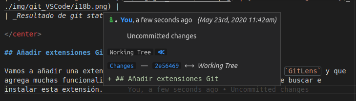
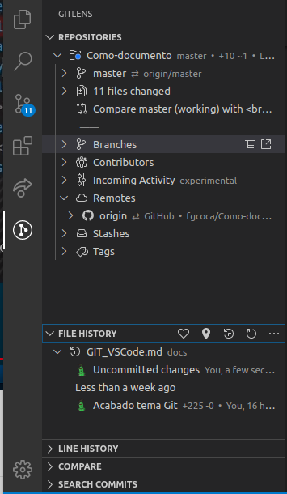

# Git en VSCode

## Cosas básicas de Git

Git es un **software libre** de gestión de versiones, lo que viene a significar que es un sistema que nos ayuda a controlar y gestionar los cambios generados en nuestro trabajo, ya sea software, documentación o cualquier otro uso.

Fue creado por [Linus Torvalds](https://es.wikipedia.org/wiki/Linus_Torvalds) para la comunidad Linux hacia el año 2005.

La relación de tareas fundamentales en git y que vamos a describir en este tutorial son las siguientes:

* Configurar e inicializar un repositorio
* Iniciar y detener el seguimiento de archivos
* Preparar cambios con `stage`
* Confirmar cambios con `commit`
* Configurar git para que ignore ciertos archivos
* Corregir errores
* Recorrer la historia de nuestro proyecto y ver cambios entre confirmaciones
* Enviar con `push` y recibir con `pull` de repositorios remotos

Es necesario conocer, aunque sea brevemente, en que consisten estos pasos para poder efectuarlos con garantias desde VSCode. Se remite al lector a la webgrafía para consultar estos aspectos, y mas concretamente al libro de git.

Desde la paleta de comandos, disponible como se observa en la imagen 1, podemos hacer uso de comandos git.

| _Imagen 1_ |
| :-:|
|  |
| _Acceso a la paleta de comandos_ |

En la imagen 2 vemos la paleta de comandos con el comando clone de git y como una vez ejecutado nos pide la dirección URL a clonar.

| _Imagen 2_ | |
| :-:| :-:|
|  |  |
| _Comando git clone_ | _Solicitud URL para clonar_ |

## Git en la barra de estado de VSCode

En la barra de estado que se muestra en la parte inferior de la ventana de VSCode se muestran funciones e información de Git muy útiles.

* A la izquierda se muestra el nombre de la rama de trabajo actual. Si modificamos los archivos con seguimiento en la rama de trabajo, la barra de estado agrega un símbolo de asterisco (*) junto al nombre de la rama, tal y como se observa en la imagen 3.

| _Imagen 3_ |
| :-:|
|  |
| _Barra de estado: Rama de trabajo actual mostrando cambios_ |

Cuando agreguemos los cambios al `stage`, el asterisco se va a convertir en un signo más (+) para indicar que se han agregado. Cuando confirmemos los cambios `staged`, ese signo más desaparece y solamente se mostrará el nombre de la rama.

* A la derecha del nombre de la rama aparece un icono en forma de un círculo con flechas que indica que el sistema debe sincronizar cambios. En la imagen 4 vemos este icono.

| _Imagen 4_ |
| :-:|
|  |
| _Barra de estado: icono sincronizar cambios_ |

Ese icono con forma de circulo se convierte en una nube con una flecha hacia arriba cuando el sistema está listo para publicar cambios.

## Cambios en archivos

El editor VSCode dispone en su barra de actividades de un acceso a las herramientas git disponibles por defecto y, como veremos mas adelante, también se le pueden instalar complementos para este tema. En la imagen 5 observamos es icono de acceso y vemos un número en un circulo azul que nos indica que hay un número determinado de cambios pendientes de sincronizar con la nube. El número indica cuantos cambios hay pendientes, tanto staged como unstaged (con seguimiento y sin seguimiento)) y listos para confirmarse. El número se incrementa a medida que realicemos cambios en los archivos.

| _Imagen 5_ |
| :-:|
|  |
| _Herramientas GIT en VSCode_ |

Este número se corresponde con la aparición de un asterisco (*) en la barra de estado junto al nombre de la rama en la que estamos trabajando.

Una vez confirmemos, este icono  con número desaparece asi como el asterisco de la barra de estado.

También podemos consultar esto desde una terminal ejecutando un `git status` que nos devolverá información como la que vemos en la imagen 6. Lo habitual será usar una combinación de operaciones de Git desde la línea de comandos y funciones de Visual Studio Code integradas con Git.

| _Imagen 6_ |
| :-:|
|  |
| _Consulta del estado de git desde una terminal_ |

##  Ver cambios en Control de código fuente

Si pulsamos el icono de `Control de código fuente` de la barra de actividades (como vemos en la imagen 7) podremos ver los cambios `staged` y `unstaged`.

| _Imagen 7_ |
| :-:|
|  |
| _Acceso a Control de cambios_ |

Si hacemos clic, por ejemplo, en el archivo que vemos en la imagen 8 observamos una serie de iconos e información asociada al mismo que vamos a describir seguidamente.

| _Imagen 8_ |
| :-:|
|  |
| _Información de control de seguimiento_ |

Lo primero que observamos es que el archivo aparece en **cambios**. Los iconos de izquierda a derecha son:

* **Archivo**: permite abrir el archivo en el editor .
* **Signo más (+)**: Al pulsar este icono se agregan los cambios al "stage" y se confirman.
* **Flecha sentido antihorario**: para descartar los cambios y revertir el archivo a su estado en la confirmación anterior.
* **Número**: indica los problemas que el editor encuentra en el archivo, tal y como se describió para la terminal. En este caso concreto 9+ nos está indicando que hay más de 9 problemas.
* **Letra**: Si es una _M_ nos indica que el archivo existía anteriormente y ha sido modificado y si es una _U_ nos está indicando que el archivo es nuevo y no tiene seguimiento.

Moviendo el cursor por los distintos archivos que se muestran en cambios podemos ir viendo toda la información descrita y realizando las acciones asociadas a los iconos.

Si presionamos el signo más por ejemplo en el archivo i1.png este archivo se traslada a la sección `cambios almacenados provisionalmente` o `stage`. Vemos el resultado en la imagen 9, donde se observan los iconos asociados al archivo para esta sección.

| _Imagen 9_ |
| :-:|
|  |
| _Archivo cambiado a stage_ |

Podemos ir añadiendo los archivos uno a uno de esta forma o bien hacerlo desde Cambios (imagen 10) para agregarlos todos a un tiempo.

| _Imagen 10_ |
| :-:|
|  |
| _Almacenar todos los cambios_ |

El signo menos (-) permite sacar el archivo a la sección `Cambios`, el icono archivo nos permite abrirlo y en este caso la letra A indica que se ha añadido (Add) al índice.

Es importante entender que en esta situación estos cambios son locales y no están sincronizados con la nube y tambén que observemos los cambios que se producen en la barra de estado para acostumbrarnos a reconocer el estado de nuestro trabajo.

## Introducir cambios, Commit

En el Control de código fuente se muestran varios iconos en la esquina superior derecha que encontramos destacados en amarillo en la imagen 10. El icono de marca de verificación sirve para empezar a confirmar los cambios. Si pulsamos este icono se nos presenta la situación de la imagen 11.

| _Imagen 11_ |
| :-:|
|  |
| _Confirmar cambios_ |

La intención es agregar un mensaje de confirmación al commit que confirmamos con `Enter` (o bien `Ctrl + Enter` según donde hagamos clic) y como observamos se nos indica a que rama va a ser confirmado. Vamos en nuestro caso a teclear _Confirmar i1.png_. Hay que tener en cuenta que este mensaje se suele restringir a 50 caracteres.

Una vez confirmado el cambio podemos observar que en la barra de estado (imagen 12) aparece un mensaje indicador de que hay un archivo pendiente de sincronizar.

| _Imagen 12_ |
| :-:|
|  |
| _Barra de estado: sincronizar_ |

Como se observa en la imagen 12 está el icono de sincronización y a su derecha una flecha hacia abajo con un cero, que indica que no hay confirmaciones pendientes de sincronizar o extraer. A la derecha hay una flecha hacia arriba con un 1 junto a ella, que indica que hay una confirmación para insertar en el repositorio.

Si hacemos clic en el icono se mostrará un mensaje (imagen 13) relativo a que vamos a realizar las operaciones `git pull` y, después, una operación `git push`.

| _Imagen 13_ |
| :-:|
|  |
| _Sincronizar: git pull y git push_ |

La operación `git pull` incorpora los cambios de un repositorio remoto a la rama local y la operación `git push` hace lo contrario, incorpora los cambios de una rama local a un repositorio. Hacer clic en el icono sincronizar de la barra de estado realiza ambas operaciones.

Si queremos o tenemos la necesidad de realizar estas operaciones por separado podemos recurrir a teclearlas en una terminal o bien señeccionarla desde las disponibles cuando hacems clic en el icono diéresis de la barra de Control de código fuente. En la imagen 14 vemos las opciones disponibles.

| _Imagen 14_ |
| :-:|
|  |
| _Acciones de control de codigo fuente_ |

Si ahora vamos al directorio correspondiente en nuestro github podemos comprobar como ya está el archivo añadido a la rama master, tal y como se observa en la imagen 15.

| _Imagen 15_ |
| :-:|
|  |
| _Verificacion en Github del Push realizado_ |

## Analisis de cambios en archivos

Una herramienta muy útil de VSCode es la que vamos a ver seguidamente. Como observamos en la imagen 16 en el archivo señalado se han realizado cambios.

| _Imagen 16_ |
| :-:|
|  |
| _Archivo que ha sufrido cambios_ |

 Pero ¿cuales son esos cambios?. Pues bien, si hacemos clic sobre el archivo y ocultamos el navegador haciendo clic sobre el icono de control de código veremos una ventana como la de la imagen 17, donde vemos dos columnas, la de la izquierda muestra el archivo antes de realizar cambios y la de la derecha muestra los cambios realizados.

| _Imagen 17_ |
| :-:|
|  |
| _Comparación del archivo con cambios_ |

Esto se puede conseguir directamente desde la línea de comandos en una terminal tecleando `git status` que mostrará en que archivo se han realizado los cambios y después `git diff <nombre del archivo>` del que mostrar las diferencias. En la imagen 18 vemos el resultado de ejecutar estos comandos.

| _Imagen 18_ | |
| :-:| :-:|
|  | |
| _Resultado de git status_ | _Resultado de git diff_ |

## Añadir extensiones Git

Vamos a añadir una extensión muy interesante de VSCode que se llama `GitLens` y que agrega muchas funcionalidades. En la imagen 19 vemos el resultado de buscar e instalar esta extensión.

| _Imagen 19_ | |
| :-:| :-:|
|  | |
| _Autorun de GitLens tras instalar_ | _GitLens instalado_ |

Vamos a ver las principales funcionalidades de `GitLens`:
* Cuando nos situamos sobre cualquier linea (imagen 20), incluso en la que estamos escribiendo, se nos informa del autor del último commit, cuando se hizo y si los cambios han sido confirmados o no.

| _Imagen 20_ |
| :-:|
|  |
| _Información de GitLens_ |

Si dejamos unos instante el cursor sobre la información esta será ampliada en una ventana emergente tal y como observamos en la imagen 21.

| _Imagen 21_ |
| :-:|
|  |
| _Información de GitLens ampliada_ |

* Una segunda funcionalidad interesante de `GitLens` es la que observamos en la imagen 22. Se trata de unas líneas verticales de color azul o verde que indican los cambios realizados en el archivo, en concreto el color azul indica que la línea ha sido modificada y el color verde que ha sido añadida. En ambos casos, si situamos el cursor sobre la línea esta de engrosa.

| _Imagen 22_ |
| :-:|
|  |
| _Información de GitLens: modificación o nuevo_ |

Si hacemos clic sobre una de las líneas, por ejemplo la modificada, se nos despliega la información que vemos en la imagen 23. 

| _Imagen 23_ |
| :-:|
|  |
| _Información de GitLens: desiegue_ |

Podemos observar como se realiza la comparación de la linea antes y después de modificarla y muy importante es que para esta modificación (no para todo el archivo) disponemos de las herramientas asociadas a control de código, pero que si las usamos tan solo se aplican a esta línea.

* Si hacemos clic sobre el icono de `GitLen` se nos despliegan las funcionalidades que tiene la extensión y que van desde la información del repositorio o del archivo, permite realizar comparaciones (igual que `git staff`) e incluso buscar commits. En la imagen 24 las vemos.

| _Imagen 24_ |
| :-:|
|  |
| _Funcionalidades de GitLens_ |

## Creación del archivo README.md remoto. `Git pull`

Para ver el funcionamiento de la orden `git pull` vamos a crear un archivo en la nube, para ello nos dirigimos al repositorio, donde nos encontramos con la situación que vemos en la image 25. 

| _Imagen 25_ |
| :-:|
|  |
| _Creación en la nube de README.md_ |

Si hacemos clic en el botón señalado se nos crea la estructura básica del archivo, tal y como observamos en la imagen 26, donde ya hemos añadido algunas líneas.

| _Imagen 26_ |
| :-:|
|  |
| _El archivo README.md con su contenido inicial_ |

Si nos desplazamos hacia abajo en la página nos encontramos con la información para `commit` que hacemos sin modificar el mensaje por defecto, tal y como se observa en la imagen 27.

| _Imagen 27_ |
| :-:|
|  |
| _Realizamos commit del archivo README.md_ |

El resultado final en la nube lo vemos en la imagen 28, donde se observa aque ya existe el archivo y su aspecto.

| _Imagen 28_ |
| :-:|
|  |
| _Archivo README.md creado_ |

Lógicamente este archivo no lo tenemos en el repo local. Disponemos de varias formas de hacer que esto se solucione. Desde `control de cambios` escogemos la opción que vemos en la imagen 29 que se corresponde con `git pull`.

| _Imagen 29_ |
| :-:|
|  |
| _Acceso a pull_ |

Nos va a mostrar una ventana solicitando la selección del origen remoto del que hacer pull, tal y como observamos en la imagen 30. 

| _Imagen 30_ |
| :-:|
|  |
| _Selección del origen remoto_ |

Escogemos la rama de donde vamos a realizar la extracción, como se observa en la imagen 31.

| _Imagen 31_ |
| :-:|
|  |
| _Selección de la rama remota_ |

En unos instantes el aspecto que toma VSCode es el que vemos en la imagen 32.

| _Imagen 32_ |
| :-:|
|  |
| _Reflejo de los cambios para pull_ |

Cuando confirmemos los cambios nos aparecerá en el repo local el archivo creado en la nube, tal y como se observa en la imagen 33.

| _Imagen 33_ |
| :-:|
|  |
| _Acción pull finalizada_ |

## Observación final

Esto que hemos visto es tan solo lo imprescindible de Git para poder trabajar de forma local y poder reflejar los cambios en la nube pero en ningún caso es información completa de Git.
