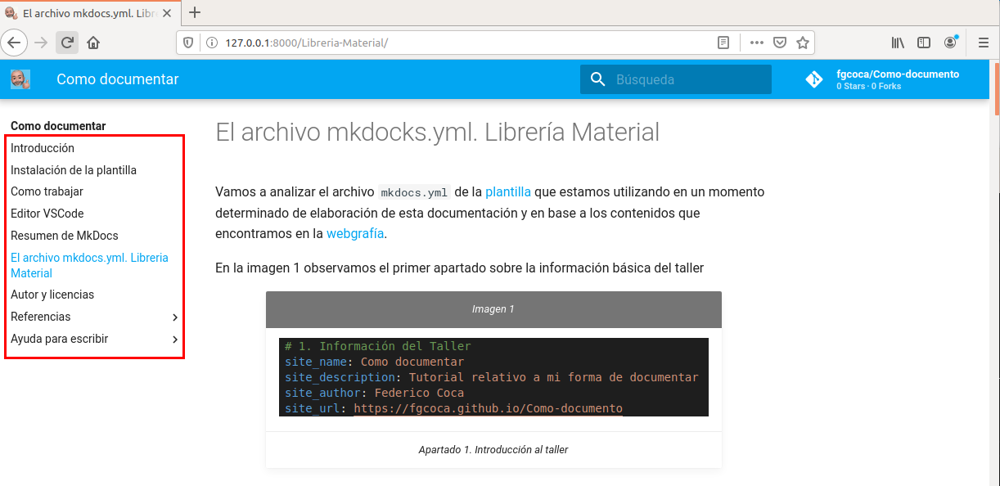

# El archivo mkdocks.yml. Librería Material

Vamos a analizar el archivo `mkdocs.yml` de la [plantilla](https://github.com/lajaqueria/plantilla-taller) que estamos utilizando en un momento determinado de elaboración de esta documentación y en base a los contenidos que encontramos en la [webgrafía](Referencias/webgrafia.md).

En la imagen 1 observamos el primer apartado sobre la información básica del taller

| _Imagen 1_ |
|:-:|
|  |
| _Apartado 1. Introducción al taller_ |

Vamos a relacionar cada punto del apartado 1 con su significado y su reflejo en el navegador.
* **site_name**. Es el nombre del sitio web
* **site_description**. Aquí ponemos la descripción de nuestro sitio web y el apartado forma parte de los metadatos que utilizará el script Python que traduce markdown a html y será usado como un meta atributo.
* **site_autor**. Metadato correspondiente a la autoria del sitio web.
* **site_url**. La dirección url que se asigna al activar `gh-pages` en la creación del repositorio.

En la imagen 2 vemos algunos de estos puntos reflejados.

| _Imagen 2_ |
|:-:|
|  |
| _Apartado 1 visto en el navegador_ |

En la imagen 3 vemos el apartado segundo que en nuestro caso está compuesto por:

* **repo_name**. Nombre del repositorio que junto con **repo_url** conforman el enlace al repositorio.
* **repo_url**. Dirección url del repositorio.
  
El nombre del repositorio aparece junto al recuadro de búsqueda o en la barra de navegación, dependiendo del tamaño de la ventana, tal y como se ha representado en la imagen 2.

* **edit_uri**. Ruta de acceso desde la base del directorio al `repo_url` cuando se visualiza directamente una página.

| _Imagen 3_ |
|:-:|
|  |
| _Apartado 2. Repositorio_ |

El apartado **3. Copyright** se muestra en el navegador de la forma que vemos en la imagen 4.

| _Imagen 4_ |
|:-:|
|  |
| _Copyright_ |

El punto 4 se refiere a los enlaces a redes sociales que se pueden mostrar en el pie de página usando la fuente [FontAwesome](https://fontawesome.com/icons?d=gallery). El parámetro `type` mostrará el nombre del servicio, y `link` la URL a enlazar. En la imagen 5 vemos una posible configuración que es probable que con el servidor local no tenga efecto o no de problemas, en cuyo caso podemos comentar estas líneas y etiquetar la tarea como TODO: para descomentarla en el momento de hacer el despliegue final.

| _Imagen 5_ |
|:-:|
|  |
| _Enlaces a RRSS_ |

El apartado 5 configura el índice de navegación que se muestra en el navegador. En la imagen 6 vemos parte del mismo para esta documentación.

| _Imagen 6_ |
|:-:|
|  |
| _Configuración del índice de navegación_ |

En la imagen 7 vemos el aspecto de este índice en el navegador.

| _Imagen 7_ |
|:-:|
|  |
| _Aspecto del índice de navegación en un navegador_ |

El apartado **6. Google Analytics** permite analizar el uso de nuestro repositorio mediante la integración de esta herramienta. En nuestro caso no la vamos a utilizar.

El apartado **7. Configuración del tema** nos va a permitir adaptar, dentro de las opciones disponibles, el aspecto final de nuestro sitio web. Activamos las modificaciones del tema _Material_ configuran `mkdocs.yml` como vemos en la imagen 8.

| _Imagen 8_ |
|:-:|
|  |
| _Modificaciones del tema Material_ |

En nuestro caso vamos a configurar los aspectos que vemos en la imagen 9 y que explicamos un poco mas a fondo seguidamente.

| _Imagen 9_ |
|:-:|
|  |
| _Configuraciones del tema Material_ |

Lo primero que hacemos es configurar los colores que tienen como valores posibles `red`, `pink`, `purple`, `deep purple`, `indigo`, `blue`, `light blue`, `cyan`, `teal`, `green`, `light green`, `lime`, `yellow`, `amber`, `orange`, `deep orange`, `brown`, `grey`, `blue grey` y `white`. Los últimos cuatro solo pueden usarse como `primary`.

En la imagen 10 vemos destacados los de nuestra configuración.

| _Imagen 10_ |
|:-:|
|  |
| _Configuración de colores_ |

En este [enlace](https://squidfunk.github.io/mkdocs-material/getting-started/#primary-colors) podemos comprobar visualmente el funcionamiento de estos colores.

A continuación tenemos la configuración de fuentes, que por defecto son `Roboto` y `Roboto Mono`. Estas fuentes forman parte de [Google Fonts](https://fonts.google.com/) y podemos cambiarlas por otras. 

Los siguiente que aparece es el logo y el favicom que en mi caso configuro con la misma imagen. El favicon se refiere a un icono de 16x16 px (o 32x32 px) que sirve para identificar un sitio web en las pestañas del navegador. El icono debe tener una resolución mínima de 128x128 y se aconseja que presente suficiente constraste con el color de fondo. En la imagen 11 vemos estos dos elementos en el navegador.

| _Imagen 11_ |
|:-:|
|  |
| _Temas favicon e icono_ |

Seguidamente se configura el idioma como español y también los idiomas de búsqueda como español e inglés. En la imagen 12 vemos esta configuración y en el [enlace](https://squidfunk.github.io/mkdocs-material/getting-started/#language) podemos consultar los idiomas disponibles.

| _Imagen 12_ |
|:-:|
|  |
| _Idiomas principal y de búsqueda_ |

Los apartados 8 y 9 se dedica a las extensiones instaladas actualmente y el apartado 10 a los plugin y en concreto al minify ya descrito en la sección [como trabajar](trabajo.md) que tiene la utilidad de eliminar espacios en blanco, elimina comentarios, etc.

