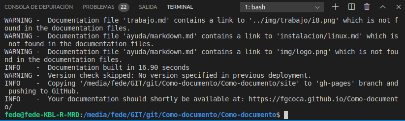
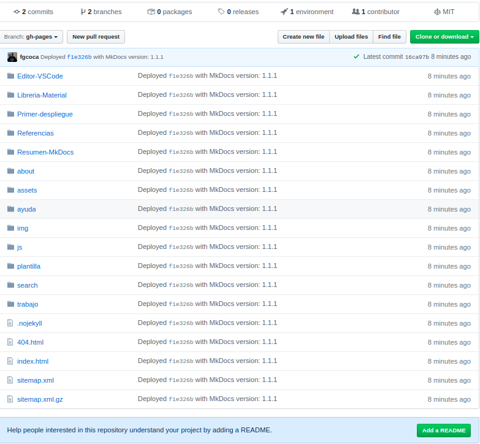
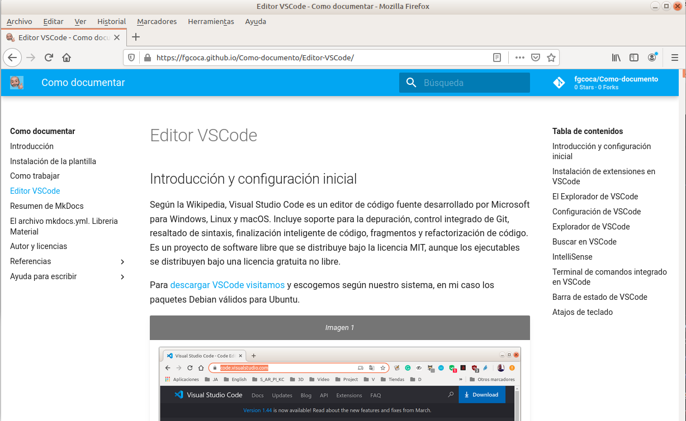
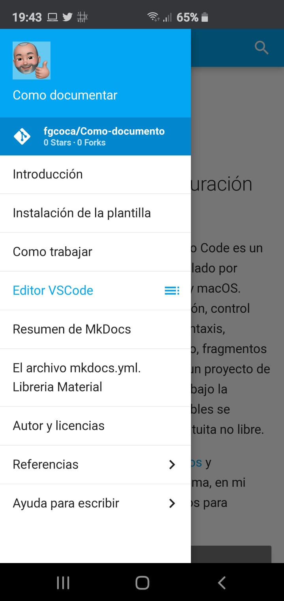

# Primer despliegue

Vamos a hacer el primer despliegue de nuestro trabajo para ver como queda online, para ello debemos ejecutar `pipenv run mkdocs gh-deploy` desde la terminal de VSCode con el servidor detenido y esperar a que finalice el trabajo que es cuando se muestra algo similar a lo que vemos en la imagen 1.

| _Imagen 1_ |
|:-:|
|  |
| _Primer despliegue finalizado_ |

Si nos dirigimos al repositorio en github y desplegamos la rama `gh-pages` tendremos un resultado similar al de la imagen 2.

| _Imagen 2_ |
|:-:|
|  |
| _Aspecto del primer despliegue en el repositorio_ |

En la imagen 3 vemos el resultado en el navegador Mozilla Firefox.

| _Imagen 3_ |
|:-:|
|  |
| _Primer despliegue visto en el navegador Mozilla Firefox_ |

Otra de las grandes ventajas que tiene el sistema de documentación que estamos viendo es que da formato automáticamente para visualización en dispositivos móviles, lo que le da muchisima versatilidad al sistema. En la imagen 4 vemos este primer despliegue en la pantalla de un teléfono móvil.

| _Imagen 4_ |
|:-:|
|  |
| _Primer despliegue visto en móvil_ |

Lo que nos queda a partir de ahora es aprender lo necesario de Git como para ir actualizando el desarrollo local en la nube.
