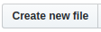
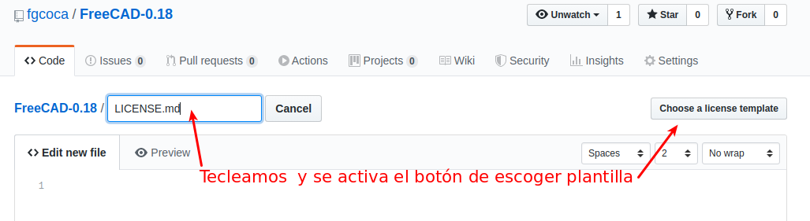
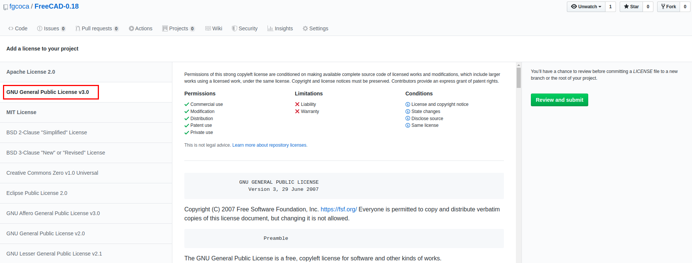
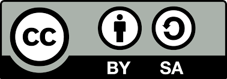

# Licencias

Vamos a hablar muy brevemente de algunos tipos de licencias y de como incluirlas en nuestro proyecto.

En concreto vamos a ver como podríamos añadir otra licencia online y en segundo lugar vamos a añadir a nuestro proyecto una Licencia [Creative Commons Atribución-CompartirIgual 4.0 International ("CC BY-SA")](https://creativecommons.org/licenses/by-sa/4.0/deed.es).

## Licencia MIT

La licencia MIT fue la establecida al crear el repositorio en GitHub y está disponible para su lectura en el mismo repositorio a través de este [enlace](https://github.com/fgcoca/Como-documento/blob/master/LICENSE).

## Licencia GNU

Vamos a añadir la Licencia de Documentación Libre GNU General Public License v3.0. Para ello estando en el repositorio online hacemos clic en el botón.

En la ventana que se abre debemos teclear, siempre en mayúsculas LICENSE o LICENSE.md (imagen 1) y se nos activará la opción de escoger una licencia desde una plantilla.

| _Imagen 1_ |
|:-:|
|  |
| _Añadir licencia a repositorio_ |

La ventana que se nos abre nos muestra las licencias disponibles y por ejemplo (imagen 2) podemos agregar la licencia GNU y que estará disponible en el archivo que se crea.

| _Imagen 2_ |
|:-:|
|  |
| _Añadir licencia GNU_ |

El texto de la licencia queda alojado en la raíz de la rama master y tendremos que hacer `git pull` para tenerlo en el repo local y que sea añadido al sitio cuando realicemos el despliegue.

## Licencia CC BY-SA 4.0

En este caso simplemente vamos a poner los enlaces a la licencia y el gráfico asociado a la misma.

* La información en español de la licencia está en [CC BY-SA 4.0](https://creativecommons.org/licenses/by-sa/4.0/deed.es)
* La información en ingés de la licencia está en [CC BY-SA 4.0](https://creativecommons.org/licenses/by-sa/4.0/deed.en)
* La información sobre como compartir nuestro trabajo está en [Creative Commons - Share your work](https://creativecommons.org/share-your-work/)
