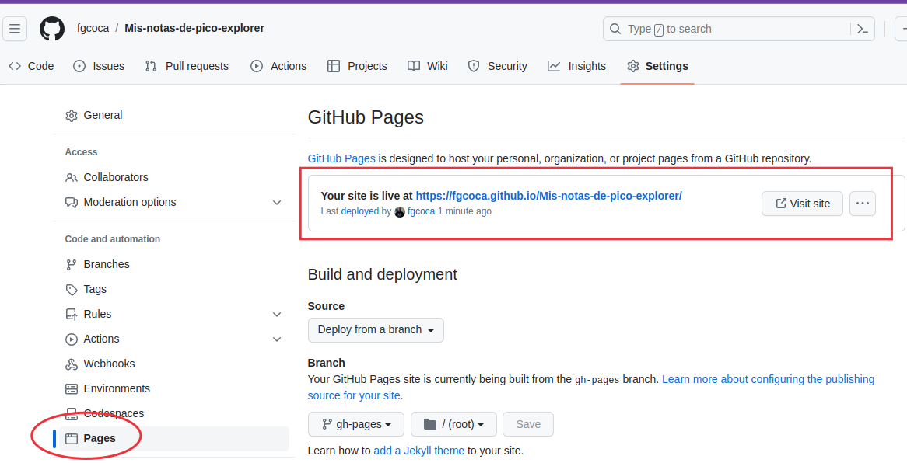

# Como documento mis proyectos

## <FONT COLOR=#FF0000>**NOVEDADES**</font>
Cristobal Contreras ha realizado una actualización de la plantilla de [La Jaqueria](https://github.com/lajaqueria/plantilla-taller) para documentar talleres, debido fundamentalmente a que la herramienta pipenv ha quedado obsoleta, aunque se puede seguir utilizando.

El resto de esta documentación puede seguir resultando válida si tenemos en cuenta todas las actualizaciones realizadas desde que se inició la misma allá por mayo de 2020.

Resumo a continuación los aspectos fundamentales citados en la nueva plantilla:

* Sigue siendo necesario tener instalado [Python 3](https://www.python.org/downloads/) y el gestor de paquetes de Python [PIP](https://pip.pypa.io/en/stable/installation/). **Ignoramos todo lo que haga referencia a pipenv**.
* Sigo utilizando como editor de texto [Visual Studio Code](https://code.visualstudio.com/) con las extensiones recomendadas en la plantilla y algunas otras que he ido descubriendo.
* El proceso de **instalación de la plantilla** sigue siendo básicamente el mismo con las siguientes salvedades:

En Setting nos dirigimos a Pages y ahora se muestra como vemos en la imagen siguiente, sin tener que hacer nada mas por defecto.

<center>

  
*Enlace a la web en Settings/Pages*

</center>

Si estamos utilizando una plantilla adaptada, como es mi caso, la actualizamos con la nueva plantilla-taller descargada y procedemos a realizar la copia de archivos en el directorio donde hemos clonado el repo. Debemos copiar:

* Carpeta docs
* mkdocs.yml
* Pipfile
* .gitignore
* requirement.txt
* LICENSE

<b>Lo que vamos a ver a continuación es totalmente nuevo.</b>

Tenemos que preparar el equipo para trabajar con la plantilla. Nos situamos en la carpeta con la que vamos a trabajar, abrimos una terminal y creamos el entorno virtual e instalamos todas las dependencias con:

* Creamos el entorno virtual: ```python -m venv env```
* Activamos el entorno virtual: ```source env/bin/activate```
* Instalamos las dependencias: ```pip install -r requirements.txt```

**Cuando montamos el entorno virtual debemos tener presente que si estamos trabajando con una unidad USB formateada con FAT32 el entorno ```virtualenv``` no puede trabajar en estas unidades desde Linux. Sería necesario poner los archivos en una unidad que soporte permisos POSIX. Es decir:**

* **Con un disco formateado en FAT32, ```venv``` espera poder establecer permisos en estos archivos, y FAT32 no los tiene.**
* **Así que, para solucionarlo, necesitamos formatear la unidad USB con un sistema de archivos "adecuado". XFS o ext4 serían las opciones naturales en Linux.**

Para poder ver el taller en local como si estuvieramos en Internet, es necesario levantar un servidor de pruebas. Es tan sencillo como desde la terminal en la carpeta de trabajo hacer:

* Activar el entorno virtual: ```source env/bin/activate```
* Correr el servidor: ```mkdocs serve```

Ahora en el navegador podemos ir viendo como va quedando en la web [http://127.0.0.1:8000/]().

Para probar que todo está correcto podemos hacer nuestro primer despliegue con:

<center>pipenv run mkdocs gh-deploy</center>

<hr width=100%  size=10 noshade="noshade">

## <FONT COLOR=#FF0000>**La documentación original**</font>
Voy a tratar de poner en este tutorial todo lo necesario para crear de forma sencilla la documentación de un proyecto cualquiera y tenerlo disponible como una página de GitHub.

Para ello voy a seguir la plantilla de [La Jaqueria](https://github.com/lajaqueria/plantilla-taller) creada por Cristobal Contreras donde explica claramente todo lo que necesitamos para documentar de esta forma que vamos a explicar.

La plantilla realizada con MkDocs utiliza la libreria Material y el editor de texto que usaremos será el VSCode.

Antes de nada debemos asegurarnos de tener cubiertos los requisitos previos siguientes:

1.- Tener Python 3 instalado.

Antes de nada actualizamos nuestro sistema.

* `$ sudo apt update`. Actualizamos lista de paquetes y sus versiones
* `$ sudo apt -y upgrade`. Instala las nuevas versiones de los paquetes actualizados.

Comprobamos si tenemos instalado Python tecleando en una terminal lo siguiente:

* Versión 2.7: `$ python -V`. Devolverá algo similar a: `$ Python 2.7.17`
* Versión 3: `$ python3 -V`. Devolverá algo similar a: `$ Python 3.6.9`

2.- Instalar PIP, el gestor de paquetes de Python.

* `$ sudo apt install -y python3-pip`
* Comprobar la versión PIP instalada: `$ pip --version` o `$ pip3 --version` Esto devolverá algo similar a: `pip 20.0.2 from /usr/local/lib/python3.6/dist-packages/pip (python 3.6)`

3.- Instalar `Pipenv` para tener un flujo de trabajo en Python: `$ pip install pipenv`.

Toda la documentación va a estar realizada con Ubuntu 18.04 de nombre clave Bionic Beaver y todas las herramientas que se detallan en el apartado [software utilizado](Referencias/sof.md)
