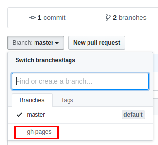
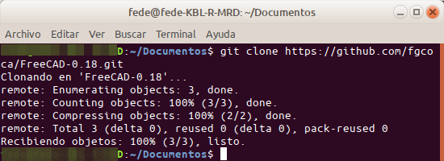

# Instalación de la plantilla

La plantilla está pensada para ser usada en un repositorio, aunque se puede usar de manera local.

Seguimos el siguiente proceso:

- Creamos un repositorio en Github tal y como observamos en la imagen 1. Añadimos la licencia MIT.

| _Imagen 1_ |  
| :-: |  
||
|_Datos para crear un nuevo repositorio en Github_|

Tras unos instantes se mostrará el resultado que vemos en la imagen 2.

| _Imagen 2_ |
| :-: |
| |
|_Repositorio recién creado con licencia MIT_ |

- A ese repositorio le creamos una rama que se llame gh-pages (GitHub-páginas). Para ello procedemos de la siguiente forma:

Vamos a la página principal del repositorio y desplegamos el menú selector de ramas, que en un repositorio recién creado tiene el aspecto de la imagen 3.

| _Imagen 3_ |
| :-: |
| | 
|_Selector de ramas_ |

El aspecto al desplegar el menú es el de la imagen 4.

 

| _Imagen 4_ |
| :-: |
| | 
|_Menú selector de ramas al desplegarlo_ |

Procedemos como vemos en la imagen 5.

| _Imagen 5_ |
| :-: |
| | 
|_Creación de una nueva rama_ |

Una vez terminada la tarea el aspecto de nuestro repositorio (imagen 6) muestra que tiene dos ramas, la master y la recién creada.

| _Imagen 6_ |
| :-: |
| | 
|_Repo con dos ramas_|

Con esto hemos creado una rama de código especial llamada gh-pages o páginas GitHub. Esta rama es un servicio de alojamiento de sitio estático que toma archivos HTML, CSS y JavaScript directamente desde un repositorio en GitHub, y a través de un proceso de compilación publica un sitio web.  La URL toma la forma `usuario.github.io/mi-repositorio`.

Si necesitamos borrar una rama previamente creada hacemos clic en el número de ramas (branches) y se nos abrirá una nueva ventana (imagen 7) con todas las ramas, basta con localizar la que queremos eliminar y hacer clic sobre la papelera.

| _Imagen 7_ |
| :-: |
| |
|_Eliminar una rama en un repositorio_ |

- En la sección _Settings_ del repositorio, localizamos la parte de _Github Pages_ y habilitamos la opción de usar la rama _gh-pages_ creada tal y como vemos en la imagen 8 haciendo clic en _gh-pages branch_.

| _Imagen 8_ |
| :-: |
| | 
|_Habilitar rama para su uso_ |

La URL que vemos es la dirección web del sitio y será la que enlaza con el archivo `index.html` correspondiente. En la situación que tenemos actualmente si hacemos clic en el enlace se nos generará un error como el que vemos en la imagen 9, donde indica justamente que el archivo no existe.

| _Imagen 9_ |
| :-: |
| |
|_Error por no existir aún index.html_ |

- Descargamos / clonamos el repositorio en el pc. Durante todo el tiempo vamos a trabajar en la rama master. Al desplegar tendremos algo similar a la imagen 10.

| _Imagen 10_ |
| :-: |
| |
|_Opciones de descarga_ |

Observamos que disponemos de varias opciones de descarga / clonado. La que debemos usar, que es la recomendada, es la que se ve en la imagen 10 donde podemos leer que para clonar via HTTPS debemos “Use Git or checkout with SVN using the web URL” que traducido viene a indicar que usemos la URL indicada con git o que lo hagamos con SVN (Subversion) que es una herramienta de control de versiones open source basada en un repositorio cuyo funcionamiento se asemeja enormemente al de un sistema de ficheros.

Se hace necesario utilizar algunos conceptos básicos de git que explicamos a continuación.

Desde una terminal tecleamos: `$ git –version`. Si aún no lo tenemos instalado nos pedirá que lo instalemos, lo que podemos hacer así: `$ sudo apt-get install git`. Debe devolver algo como:  `git version 2.26.2`.

La primera tarea que se debe hacer al instalar Git es configurar nuestro nombre de usuario y dirección de correo electrónico. Esto es importante porque cada commit o remisión de información de Git usará esta información. Para hacerlo teclemos las dos líneas siguientes en una terminal:

`$ git config --global user.name "@fgcoca"`

`$ git config --global user.email a@a.com`

Si hacemos una descarga zip debemos descomprimir el archivo, copiarlo en el directorio de trabajo deseado, dirigirnos a ese directorio y convertirlo en un directorio git, o sea tecleamos en una terminal lo siguiente:

`$ cd /home/user/mi_directorio`

`$ git init`

De esta forma se crea un nuevo subdirectorio llamado .git que contiene todos los archivos de repositorio necesarios, aunque todavía no se realiza el seguimiento de nada en este proyecto.

En nuestro caso, y es lo recomendado para usar la plantilla, vamos a clonar el repositorio creado y para ello nos situamos en el directorio que vamos a usar, Documentos en este caso, y tecleamos:

`~/Documentos$ git clone https://github.com/fgcoca/FreeCAD-0.18.git`

Tras unos instantes obtendremos el resultado que vemos en la imagen 11.

| _Imagen 11_ |
| :-: |
| |
|_Resultado de la clonación realizada con git_ |

Si vamos al directorio creado (Tutoriales-FreeCAD-0.18) podemos ver su contenido tal y como aparece en la imagen 12. Vemos que aparece la creación del directorio como git y que se ha descargado la licencia que es el único contenido que ahora mismo tiene.

| _Imagen 12_ |
| :-: |
| |
|_Contenido del directorio clonado con git_ |

- Descargamos / clonamos la plantilla, [plantilla-taller](https://github.com/LaJaqueria/plantilla-taller), en el ordenador y hacemos copia en nuestra carpeta de los elementos que se detallan y que vemos destacados en la imagen 13.

    Carpeta docs.
    Fichero mkdocs.yml.

    Fichero Pipfile (el Pipfile.lock no lo copiamos). Este fichero se creará más adelante de forma automática.

    Fichero .gitignore (si no está visible activamos los ficheros ocultos).

    Fichero LICENSE (si no queremos que tener licencia MIT, cambiamos su contenido, pero siempre ponemos una licencia libre a nuestro trabajo. En realidad en nuestro caso este fichero no debemos copiarlo dado que ya hemos creado el nuestro propio.

| _Imagen 13_ |
| :-: |
| |
|_Elementos de la plantilla a copiar en nuestro directorio_ |

Mas adelante veremos como añadir otras licencias.

- Nos situamos en la carpeta con la que vamos a trabajar y abrimos una terminal de comandos.

- Tecleamos `pipenv install` para crear el entorno virtual e instalar todas sus dependencias, tal y como vemos en la imagen 14.

| _Imagen 14_ |
| :-: |
| | 
|_Creación del flujo de trabajo con `pipenv`_ |

Con esto ya tenemos casi todo lo necesario para trabajar localmente.

