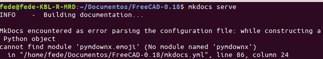
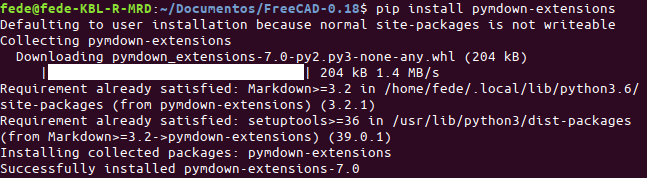
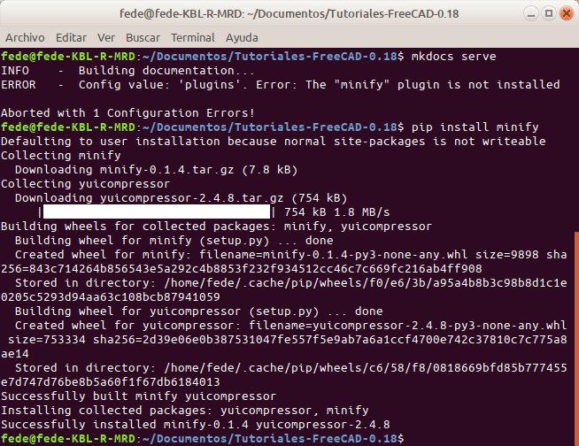
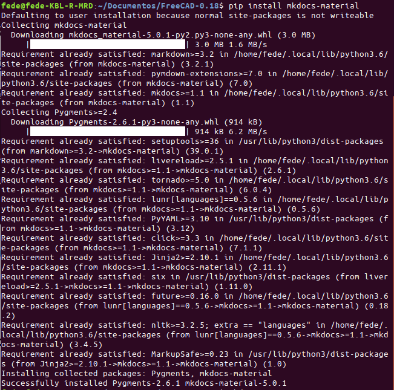
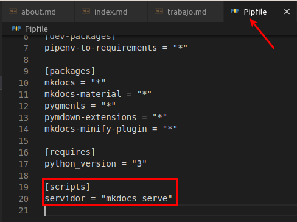
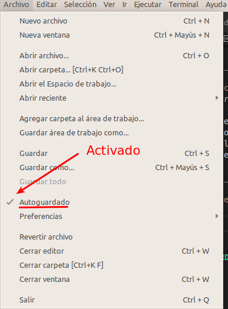
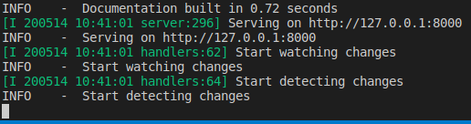
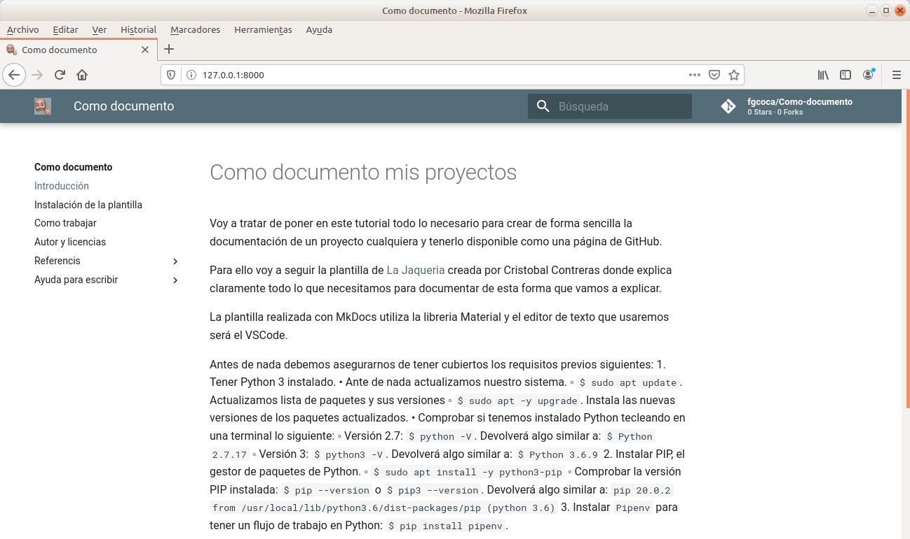

# Como trabajar

Para poder ver el avance de nuestro trabajo tal y como se verá en Internet, tenemos que poner en marcha un servidor de pruebas local. Esto es tan sencillo como teclear en la terminal anterior (si la hemos cerrado volvemos a abrirla estando en la carpeta de trabajo) lo siguiente:

`$ pipenv run mkdocs serve`

Esto monta un servidor con su propio Python para dejar el del sistema sin manipular. Este servidor se debe mantener abierto desde una terminal de comandos mientras estemos trabajando. Si queremos echarlo abajo basta con pulsar la secuencia Ctrl+C.

Es posible que al intentar montar el servidor nos genere algún tipo de error, como el que vemos en la imagen 1.

| _Imagen 1_ |
| :-: |
| |
|_Error por módulo faltante_ |

Para subsanar el error basta con instalar las [extensiones de Python para Markdown](https://facelessuser.github.io/pymdown-extensions/) tal y como vemos en la imagen 2.

| _Imagen 2_ |
| :-: |
| |
|_Instalación de módulo faltante_ |

Otro posible error que se nos puede producir y como solucionarlo lo vemos en la imagen 3. Se trata de un plugin minificador que elimina espacios en blanco, comentarios, combina archivos y optimiza / acorta algunos patrones de programación comunes.

| _Imagen 3_ |
| :-: |
| |
|_Instalación del plugin minify_ |

El mismo resultado lo obtenemos si en la terminal tecleamos lo siguiente:

`$ pip install mkdocs-minify-plugin`

Si nos genera algún tipo de error relacionado con la librería Material podemos instalarla de la forma que vemos en la imagen 4.

| _Imagen 4_ |
| :-: |
| |
|_Instalación de la libreria Material_ |

## Atajos para facilitar el trabajo

Ya hemos visto que para lanzar el servidor local tenemos que teclear `pipenv run mkdocs serve`. Podemos poner algo mas sencillo y facil de recordar para nosotros y que el comando `pipenv run` actúe de la misma forma, para ello vamos a abrir el archivo `Pipfile` y añadimos al final del archivo la entrada [scripts] y, por ejemplo, la línea que vemos en la imagen 5 justo debajo de la entrada anterior. Esto nos va a permitir lanzar al servidor tecleando `pipenv run servidor`.

| _Imagen 5_ |
| :-: |
| |
|_Añadir scripts a Pipfile_ |

Una cosa que nos va a facilitar bastante el trabajo es tener activado el autoguardado para que los cambios que realicemos en nuestros ficheros queden archivados localmente sin necesidad de hacer nada mas. En la imagen 6 vemos la ubicación de esta opción indicando el check que está activada.

| _Imagen 6_ |
| :-: |
| |
|_Opción de autoguardado en VSCode_ |

En la imagen 7 tenemos el resultado de poner en marcha el servidor local desde la línea de comandos tecleando `$ pipenv run servidor`. Debemos esperar unos instantes hasta que se nos muestre la información relativa a que la documentación se ha construido, que el servidor está disponible en `http://127.0.0.1:8000`, que comienza la visualización de cambios y la detección de cambios. 

| _Imagen 7_ |
| :-: |
| |
|_Lanzamiento del servidor local_ |

En la imagen 8 vemos el resultado de nuestro trabajo en el navegador Mozilla Firefox.

| _Imagen 8_ |
| :-: |
| |
|_Vista en navegador Mozilla Firefox_ |

